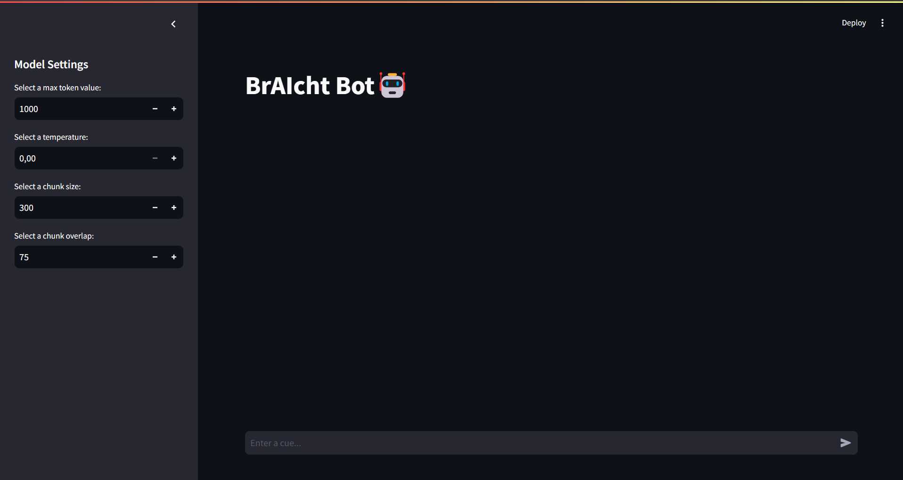

# BrAIcht Bot with LangChain, FAISS, Groq Llama 3.2 and Streamlit

The BrAIcht project introduces an AI chatbot that creates plays in the style of the famous German playwright Bertolt Brecht. 
The project utilizes Retrieval Augmented Generation (RAG) techniques using GROQ Llama 3.2, FAISS, LangChain, and Streamlit.



## Setup

To setup this project on your local machine, follow the below steps:
1. Clone this repository: <code>git clone github.com/EngBaz/Hybrid-RAG-System</code>

2. Create a virtual enviromnent
   ```console
    $ python -m venv .venv
    $ .venv\Scripts\activate.bat
    ```
3. Install the required dependencies by running <code>pip install -r requirements.txt</code>

4. Obtain an API key from OpenAI, Cohere AI and Groq. Store the APIs in a <code>.env</code> file as follows:
    ```console
    
    $ GOOGLE_API_KEY="your api key"
    $ GROQ_API_KEY="your api key"
    $ COHERE_API_KEY="your api key"
    ```
5. run the streamlit app: <code> streamlit run main.py </code>

## References

[1] QLoRA: https://arxiv.org/abs/2305.14314

[2] Hybrid RAG: https://arxiv.org/pdf/2408.05141

[3] Rerankers: https://arxiv.org/abs/2409.07691

[4] Corrective-RAG: https://arxiv.org/abs/2401.15884

[5] https://python.langchain.com/docs/tutorials/rag/


