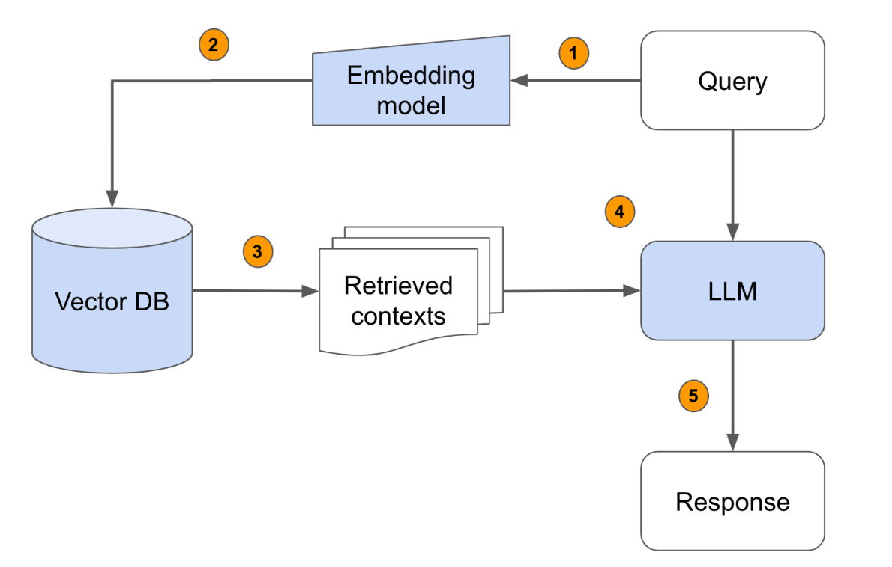

# BrAIcht, a theatrical agent that speaks like Bertolt Brecht

The BrAIcht project introduces an AI chatbot that creates plays in the style of the famous German playwright Bertolt Brecht. 
The project utilizes Retrieval Augmented Generation (RAG) techniques using <code>LLaMA 3</code>, <code>FAISS</code>, <code>LangChain</code>, and <code>Streamlit</code>.


## Setup

To setup this project on your local machine, follow the below steps:
1. Clone this repository: <code>git clone github.com/EngBaz/BrAIcht-Bot</code>

2. Create a virtual enviromnent
   ```console
    $ python -m venv .venv
    $ .venv\Scripts\activate.bat
    ```
3. Install the required dependencies by running <code>pip install -r requirements.txt</code>

4. Obtain an API key from OpenAI, Cohere AI and Groq. Store the APIs in a <code>.env</code> file as follows:
    ```console
    
    $ GOOGLE_API_KEY="your api key"
    $ GROQ_API_KEY="your api key"
    $ COHERE_API_KEY="your api key"
    ```
5. run the streamlit app: <code> streamlit run main.py </code>

## Implementation

In the project, <code>QLoRA</code> is used to fine-tune the large language models.
In this project, a <code>Retrieval Augmented Generation (RAG)</code> pipeline is created to extract context from a <code>FAISS</code> vector database containing plays by Bertolt Brecht. This context, together with the chat history, will be refined through prompt engineering and few-shot prompting to help the language model (LLM) generate text in Brecht's style.

The text data is prepared for indexing with the <code>RecursiveCharacterTextSplitter</code>, which splits the documents into coherent chunks for effective retrieval. A hybrid search strategy combines <code>semantic search</code> with <code>cosine similarity</code> and <code>keyword search</code> with <code>BM25</code>. This dual approach improves retrieval accuracy by combining contextual understanding with keyword matching and providing relevant information to the LLM.



## Related work

An article is published from this project in the GENERATIVE ART conference in Venice.
You can read the related paper [BrAIcht, a theatrical agent that speaks like Bertolt Brecht's characters](related_paper/BrAIcht.pdf).

Please not that the project in this github repo is an updated version of the published paper.

## References

[1] QLoRA: https://arxiv.org/abs/2305.14314

[2] Hybrid RAG: https://arxiv.org/pdf/2408.05141

[3] Rerankers: https://arxiv.org/abs/2409.07691

[4] Corrective-RAG: https://arxiv.org/abs/2401.15884

[5] https://python.langchain.com/docs/tutorials/rag/


